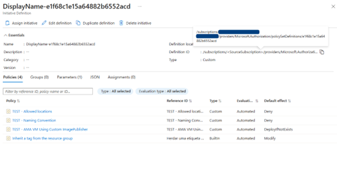
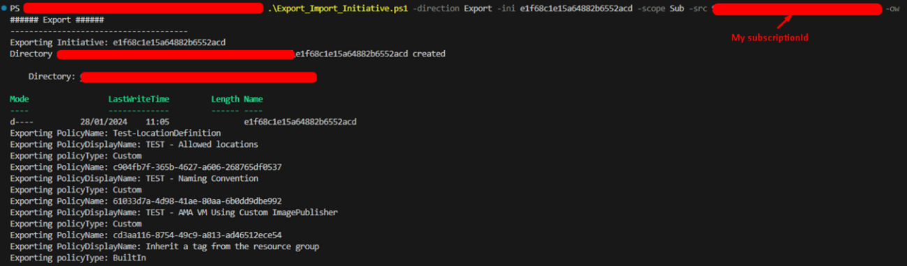
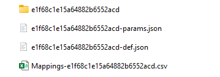
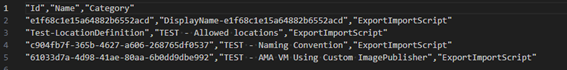
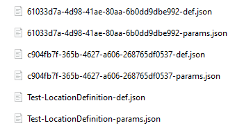

# Copy Azure Policy Initiative definitions across scopes
Creation date: 02 January 2024 \
Last Update: 04 April 2025\
Version 1.0\

## Index
- [Scenario](#Scenario)
- [Permissions Needed](#permissions-needed)
- [Export](#export)
- [Import](#Import)
- [Script Parameters](#script-parameters)
- [Script Code](#script-code)
- [Sample commands](#sample-commands)
- [Example](#example)
- [Known Limitations](#limitations-of-the-script)
- [Best Practices](#recommendations)

 
## Teaser 
Imagine you are trying to copy an Azure Policy Initiative definition and all its Azure Policy definitions from one subscription to another. This Azure Policy Initiative definition is composed of built-in and custom Azure Policy definitions. Without an automation you would need to copy the Json of each custom Azure Policy definition and its parameters, then copy the json of the Azure Policy Initiative definition and its parameters and create it on the new subscription. The logic I used in the script below is the same. 
 
## Background: 
At the time of this article Azure does not have a built-in way to move Azure Policy definitions/ Azure Policy Initiative definitions across scopes, therefore I decided to write a script that leverages the existing PowerShell commands and does it across subscriptions or management groups. In my script I will be moving Azure Policy Initiative definitions and their Azure Policy definitions, but of you need to move just Azure Policy definitions you can take out from the script the functions that will do just that. 
 
For this article I will use PowerShell, but this can be achieved both with CLI/PS/REST. 
 
## Scenario: 
Imagine you are trying to copy an Azure Policy Initiative definition and all its Azure Policy definitions from one subscription to another in the same tenant. This Azure Policy Initiative definition is composed of built-in and custom Azure Policy definitions. Without an automation you would need to copy the Json of each custom Azure Policy definition and its parameters, then copy the json of the Azure Policy Initiative definition and its parameters and create it on the new subscription. The logic I used in the script below is the same. 
 
In the script you will have parameters to control whether you are importing, exporting or doing Export + Import at once (Full), this last option you will only be able to use it if you are targeting the same scope level e.g.: Subscription A to Subscription B or Management Group X to Management Group Y because the Azure Policy Initiative json output from the export needs to reflect the target scope so that it can be imported. If you need to copy from Subscription A to Management Group X you will need to execute Export and Import separately. 

## Permissions Needed
Write permissions on the folder where you are running the script from
Reader access to the Source Scope
Policy Contributor on the Target Scope

[Back to Index](#index)
 
## <a name="export">Export - Download from source:</a> 
During the export phase some files and folders will be created therefore make sure you have permissions to write on the destination folder. 
The new files created will be: 
- <InitiativeId>.json - Azure Policy Initiative definition 
- <InitiativeId>-params.json - Azure Policy Initiative definition parameters 
- Folder with name of the InitiativeId that will contain custom policies. 
- Mappings-<InitiativeId>.csv - this file is used to keep the original names and category of Azure Policy Initiative definition and Azure Policy definitions. 
 
## <a name="import">Import – Upload to the destination: </a>
During the import, the script scans the folder looking for the value passed on the parameter $initiativeId . If it finds the json definition file, it will look for the folder that should have the custom Azure Policy definitions and it will start by creating those on the destination, once that completes it will use the Azure Policy Initiative definition file and create the Azure Policy Initiative. 
When running this step separately you should make sure that the InitiativeId.json file is updated to reflect the target scope. 
Example: you have exported from subscription AAA and you are importing to Management group XXX you need to replace each policyDefinitionId in the json from /subscription/AAA/ providers/Microsoft.Authorization/policyDefinitions/PolixyExample to /providers/microsoft.management/managementgroups/XXX/providers/microsoft.authorization/policyDefinitions/PolixyExample 


[Back to Index](#index)
 
## Script Parameters 

- **$direction:**
The direction controls whether the script will export from source, import to destination, or do both at once (Full). The allowed values are Export, Import, Full. 

- **$initativeId: (i, ini)**
The Initiative Id is the last segment of the Azure Policy Initiative resource id. 
If you pass a * on Export phase it will get all the Azure Policy Initiatives on the scope + parent scope, on the Import phase it will try to import all the Azure Policy Initiative definitions in the folder. 

- **$scope**
The scope for the Export/Import. Allowed scopes are Subscription and ManagementGroup.
You can use Sub and MG as short name of each scope. 
Default value is subscription. 
  
- **$source (src)**
The Source id, if the $scope is subscription it takes the subscription id, if the $scope is ManagementGroup it takes the Management Group Id. 
  
- **$target (t, trgt)**
The $target id, if the $scope is subscription it takes the subscription id, if the $scope is ManagementGroup it takes the Management Group Id. 
  
- **$overwrite (ow)**
The $overwrite parameter is used only on the import phase, and can be used to  overwrite the files generated by the script in case off a second execution.
 
- **$defaultCategory (dcat)**
The $defaultCategory parameter is by default “ExportImportScript” and it is used to assign a category to the Azure Policy Initiative definition and Azure Policy definitions that don’t have one set. 
 
- **$overwriteCategory (owcat)**
The $overwriteCategory parameter is used to overwrite the categories on both Azure Policy Initiative definition and Azure Policy definitions. 
This parameter is only used during the import phase. 
 
- **-Verbose**
Adds some outputs to view the commands executed and information about the execution. 
 
- **-Debug**
will show the json of policy and initiative definitions along with the debug information from the actual commands. 

[Back to Index](#index)

## Script Code: 

```

<# 
Disclaimer: This script is not supported under any Microsoft standard support program or service. This script is provided AS IS without warranty of any kind. Microsoft further disclaims all implied warranties including, without limitation, any implied warranties of merchantability or of fitness for a particular purpose. The entire risk arising out of the use or performance of the script and documentation remains with you. In no event shall Microsoft, its authors, or anyone else involved in the creation, production, or delivery of the script be liable for any damages whatsoever (including, without limitation, damages for loss of business profits, business interruption, loss of business information, or other pecuniary loss) arising out of the use of or inability to use the current script or documentation, even if Microsoft has been advised of the possibility of such damages.
#>

param (
  [Parameter(Mandatory, HelpMessage="Enter one of the valid directions: Export, Import, Full.")] [ValidateSet('Full','Export','Import')] $direction, 
  [Parameter(Mandatory, HelpMessage="Enter the Initiative Name (not displayname)")] [Alias("i", "ini")] $initativeId, 
  [Parameter(Mandatory, HelpMessage="Enter the scope (Subscription or ManagementGroup)")] [ValidateSet('Sub','mg','Subscription', 'ManagementGroup')] $scope="subscription", 
  [Parameter(HelpMessage="Enter the source subscription or Management Group (guid)")] [Alias("src")] $source, 
  [Parameter(HelpMessage="Enter the target subscription or Management Group (guid)")] [Alias("t", "trgt")] $target, 
  [switch] [Alias("ow")] $overwrite,
  [Parameter(HelpMessage="Enter the destinaton subscription or Management Group (guid)")] [Alias("dcat")] $defaultCategory="ExportImportScript", 
  [Parameter(HelpMessage="Enter the destinaton subscription or Management Group (guid)")] [Alias("owcat")] $overwriteCategory
)

function Export-Policy {
    param (
        [Parameter(Mandatory)] [ValidateNotNullOrEmpty()] [string] $folderPath,
        [Parameter(Mandatory)] [ValidateNotNullOrEmpty()] [string] $PolicyId,
        [Parameter(Mandatory)] $csvPath,
        [switch] $overwrite
    )
    Write-Verbose "#############################################################################"
    Write-Verbose "############################## Export Policy ################################"
    Write-Verbose "#############################################################################"

    $policyObj                   = Get-AzPolicyDefinition -ResourceId $PolicyId
    $policyName                  = $policyObj | Select-Object -Property Name
    $propertiesExist = [bool]($policyObj.PSobject.Properties.name -match "Properties")
    if($propertiesExist){
        $policyDefinitionProperties  = $policyObj | Select-Object -ExpandProperty properties | Select-Object -Property PolicyRule, @{Name='Parameter'; Expression='Parameters'}, DisplayName, Metadata, PolicyType
    } else {
        $policyDefinitionProperties  = $policyObj
    }

    if (([string]::IsNullOrEmpty($policyDefinitionProperties.DisplayName))) {
        $policyDisplayName = $policyName.Name
    } else {
        $policyDisplayName = $policyDefinitionProperties.DisplayName
    }
    
    Write-Output "Exporting PolicyName: $($policyName.Name)"
    Write-Output "Exporting PolicyDisplayName: $($policyDisplayName)"
    Write-Debug "Exporting policyDefRule: $($policyDefinitionProperties.PolicyRule |  ConvertTo-Json -Depth 100)"
    Write-Debug "Exporting policyDefParams: $($policyDefinitionProperties.Parameter |  ConvertTo-Json -Depth 100)"
    Write-Output "Exporting policyType: $($policyDefinitionProperties.PolicyType)"
    
    if ($policyDefinitionProperties.PolicyType -eq "Custom"){     
        Write-Verbose "Exporting PolicyRuleJsonPath: $($folderPath)\$($policyName.Name)-def.json"
        Write-Verbose "Exporting PolicyParamsJsonPath: $($folderPath)\$($policyName.Name)-params.json"

        if ($policyDefinitionProperties.Metadata.category -eq $null) {
            $policyCategory = $defaultCategory
        } else {
            $policyCategory = $policyDefinitionProperties.Metadata.category
        }

        $csvDataRow = [ordered] @{
            Id       = $policyName.Name
            Name     = $policyDisplayName
            Category = $policyCategory
        }
        $csvData = @()
        $csvData = New-Object psobject -Property $csvDataRow 

        $policyDefJson    = $policyDefinitionProperties.PolicyRule | ConvertTo-Json -Depth 100
        $policyParameters = $policyDefinitionProperties.Parameter | ConvertTo-Json -Depth 100
        $policyDefinitionFilePath = Join-Path $folderPath "$($policyName.Name)-def.json"
        $policyParametersFilePath = Join-Path $folderPath "$($policyName.Name)-params.json"
        if($overwrite){
            $policyDefJson | Out-File -FilePath $policyDefinitionFilePath
            
            if( $policyParameters -ne "{}" -and $policyParameters -ne $null -and $policyParameters -ne "null"){
                $policyParameters | Out-File -FilePath $policyParametersFilePath
            }
        } else {
            $policyDefJson | Out-File -FilePath $policyDefinitionFilePath -NoClobber
            
            if( $policyParameters -ne "{}" -and $policyParameters -ne $null -and $policyParameters -ne "null" ){
                $policyParameters | Out-File -FilePath $policyParametersFilePath -NoClobber
            }
        }

        if( $policyParameters -eq "{}"){
            Write-Verbose "No parameters for this policy."
        }

        $csvData | Export-Csv -append -Path $csvPath
    }

}

function Import-Policy{

    param (
        [Parameter(Mandatory)] [ValidateNotNullOrEmpty()] [string] $policyDefinitionFilePath,
        [Parameter(Mandatory)] [ValidateNotNullOrEmpty()] [string] $policyName,
        [Parameter(Mandatory)] $nameMappings
    )

    Write-Verbose "#############################################################################"
    Write-Verbose "############################## Import Policy ################################"
    Write-Verbose "#############################################################################"

    $policyName = $_.Name.Replace("-def.json", "")
    Write-Output "PolicyName: $($policyName)"

    $policyDefinitionFilePath=$_.policyDefinitionFilePath
    Write-Verbose "PolicyDefinitionJsonFile: $($policyDefinitionFilePath)"

    $policyParametersFilePath=$policyDefinitionFilePath.Replace("-def.json", "-params.json")
    Write-Verbose "parametersPolicyFile: $($policyParametersFilePath)"

    $newPolicyCommand = "New-AzPolicyDefinition -Name ""$($policyName)"" -Policy ""$($policyDefinitionFilePath)"""
    
    if (Test-Path -Path $policyParametersFilePath -PathType Leaf) {
        $newPolicyCommand += " -Parameter ""$($policyParametersFilePath)"" "
    }
    
    if ($nameMappings){
        $displayName = $nameMappings."$($policyName)"[0]
        if ($displayName -ne $null) {
            $newPolicyCommand += " -DisplayName ""$($displayName)"" "
        }
        $policyCategory = $nameMappings."$($policyName)"[1]
        if ($policyCategory -ne $null) {
            $newPolicyCommand += " -Metadata '{""category"":""$($policyCategory)""}' "
        }
    }                 
    
    $newPolicyCommand = "$($newPolicyCommand) $scopeParameter $target"
    
    Write-Verbose $newPolicyCommand
    Invoke-Expression -Command $newPolicyCommand
}

##### Sanitize Parameters #### 
if($direction -eq "Export" -or $direction -eq "Import"){
    if($target -eq $null){
        $target=$source #Same id
    }
}

##### Sanitize Parameters #### 
if($scope -like "m*"){
    $scopeParameter = "-ManagementGroupName "
} else {
    $scopeParameter = "-SubscriptionId "
}


if($direction -eq "Export" -or $direction -eq "Import" -or $direction -eq "Full"){
    
    #############################################################################
    ################################## Export  ##################################
    #############################################################################
    if($direction -eq "Export" -or $direction -eq "Full"){

        Write-Output "###### Export ######"
        if ($scopeParameter -like "-SubscriptionId*"){
            # If you are not connected yet you will need to run this to connect
            #Connect-AzAccount -UseDeviceAuthentication
            $context = Set-AzContext -Subscription $source
            
            if (!$context) {
                throw "Error setting the context for subscription $($source)"
            }
        }

        # To export multiple initiatives adjust the expression to return multiple initiatives. example: Get-AzPolicySetDefinition -Custom to get all custom initiatives.
        if ($initativeId -eq "*") {
            $fetchInitiaveExpression = "Get-AzPolicySetDefinition -Custom $scopeParameter $source"
        } else {
            $fetchInitiaveExpression = "Get-AzPolicySetDefinition -Name ""$($initativeId)""  $scopeParameter $source"
        }
        $initiativeList = Invoke-Expression -Command $fetchInitiaveExpression
        $initiativeList | ForEach-Object {
            $nameMappings = @()
            $InitiativeID = $_.Name
            Write-Output "--------------------------------------"
            Write-Output "Exporting Initiative: $($InitiativeID)"
            $folderPath =  Join-Path $PSScriptRoot $InitiativeID
            if (Test-Path -Path $folderPath) {
                "Directory $($folderPath) exists"
            } else {
                "Directory $($folderPath) created"
                mkdir $folderPath
            }
            
            $propertiesExist = [bool]($_.PSobject.Properties.name -match "Properties")
            if($propertiesExist){
                $properties              = $_ | Select-object -ExpandProperty Properties
                $initiativeName          = $properties | Select-Object -Property DisplayName
                $initiativeParams        = $properties | Select-object -ExpandProperty  Parameters | ConvertTo-Json -Depth 100 
                $InitiativeDefinitionObj = $properties | Select-object -ExpandProperty PolicyDefinitions
                $metadata                = $properties | Select-object -ExpandProperty Metadata
            } else {
                $initiativeName          = $_ | Select-Object -Property DisplayName
                $initiativeParams        = $_ | Select-object -ExpandProperty  Parameter | ConvertTo-Json -Depth 100 
                $InitiativeDefinitionObj = $_ | Select-object -ExpandProperty PolicyDefinition
                $metadata                = $_ | Select-object -ExpandProperty Metadata
            }
            Write-Verbose "Exporting InitiativeDisplayName: $($initiativeName.DisplayName)"

            if( $initiativeParams -ne "{}" -and $initiativeParams -ne $null -and $initiativeParams -ne "null" ){
                if($overwrite){
                    $initiativeParams | Out-File -FilePath "$($folderPath)-params.json"
                } else {
                    $initiativeParams | Out-File -FilePath "$($folderPath)-params.json" -NoClobber
                }
                Write-Verbose "Exporting InitiativeParamsJsonPath: $($folderPath)-params.json"
            } else {
                Write-Verbose "No parameters for the initiative."
            }
            
            $InitiativeDefinitionJson = $InitiativeDefinitionObj | ConvertTo-Json -Depth 100 -AsArray

            if ($direction -eq "Full") {
                $InitiativeDefinitionJson = $InitiativeDefinitionJson.replace($source, $target)
            }

            if($overwrite){
                $InitiativeDefinitionJson | Out-File -FilePath "$($folderPath)-def.json"
            } else {
                $InitiativeDefinitionJson | Out-File -FilePath "$($folderPath)-def.json" -NoClobber
            }
            
            Write-Debug "Exporting policyDefRule: $($InitiativeDefinitionJson)"
            Write-Debug "Exporting policyDefParams: $($initiativeParams)"
            Write-Verbose "Exporting InitiativeDefJsonPath: $($folderPath)-def.json"

            if (([string]::IsNullOrEmpty($initiativeName.DisplayName))){
                $initiativeDisplayName = $InitiativeID
            } else {
                $initiativeDisplayName = $initiativeName.DisplayName
            }

            #Category
            if ($metadata.category -eq $null) {
                $category = $defaultCategory
            } else {
                $category = $metadata.category
            }
            
            $mappingsCsvName = ".\Mappings-$($InitiativeID).csv"
            $csvDataRow = [ordered] @{
                Id       = $InitiativeID
                Name     = $initiativeDisplayName
                Category = $category
            }
            
            $nameMappings += New-Object psobject -Property $csvDataRow
            $nameMappings | Export-Csv -Path $mappingsCsvName -NoTypeInformation
            
            #loop through policies
            $InitiativeDefinitionObj | ForEach-Object {
                # save definition and variables file
                $policyId   = $_.policyDefinitionId
                
                if($overwrite){
                    Export-Policy -folderPath $folderPath -PolicyId $policyId -overwrite -csvPath $mappingsCsvName
                } else {
                    Export-Policy -folderPath $folderPath -PolicyId $policyId -csvPath $mappingsCsvName
                }
            }
        }
    }
    
    #############################################################################
    ################################## Import  ##################################
    #############################################################################
    if($direction -eq "Import" -or $direction -eq "Full") {

        Write-Output "###### Import ######"
        <#### IMPORTANT ######
        When running Import individually make sure the <initiativeId>-def.json file 
        contains the right target scope being that subscriptions or management groups.
        ##### IMPORTANT #####>

        if ($scopeParameter -like "-SubscriptionId*"){
            # If you are not connected yet you will need to run this to connect
            #Connect-AzAccount -UseDeviceAuthentication 
            $context = Set-AzContext -Subscription $target
            
            if (!$context) {
                throw "Error setting the context for subscription $($target)"
            }
        }
        
        # To import multiple initiatives at same time replace the $($initativeId) with * or use the parameter initativeId with value *
        Get-ChildItem -Path . -Filter "$($initativeId)-def.json" `
        | Select-Object Name, @{Name = 'initiativeDefinitionFilePath'; Expression = {$_.FullName}} `
        | Foreach-Object {
            $initiativeDefinitionFilePath = $_.initiativeDefinitionFilePath
            Write-Verbose "InitiativeJsonFile: $($initiativeDefinitionFilePath)"
            $initiativeName = $_.Name.Replace("-def.json", "")
            Write-Output "Importing policies from initiative: $($initiativeName)"
            
            $mappingsPath = ".\Mappings-$($initiativeName).csv"
            $fileExists = Test-Path -Path $mappingsPath
            $hash = @{} 
            if ($fileExists) {
                $nameMappings = Import-Csv -Path $mappingsPath
                $nameMappings | ForEach-Object { 
                    $hash[$_.Id] = @($_.Name, $_.Category)
                }
                $nameMappings = $hash
            } else {
                $nameMappings=$false;
            }
            
            $initiativePoliciesFolderPath = Join-Path "." "$($initiativeName)"
            Get-ChildItem -Path $initiativePoliciesFolderPath -Filter "*-def.json" `
            | Select-Object Name, @{Name = 'policyDefinitionFilePath'; Expression = {$_.FullName}}   `
            | Foreach-Object {
                Import-Policy -policyDefinitionFilePath $_.policyDefinitionFilePath -policyName $_.Name -nameMappings $nameMappings                
            }

            #check if has parameters file
            $initiativeParametersFilePath = $false
            Get-ChildItem -Path . -Filter "$($initiativeName)-params.json" `
            | Select-Object @{Name = 'initiativeParametersFilePath'; Expression = {$_.FullName}} `
            | Foreach-Object {
                $initiativeParametersFilePath = $_.initiativeParametersFilePath
                Write-Verbose "InitiativeParametesFile: $($initiativeParametersFilePath)"
            }
        
            $initiativeDefJson = Get-Content -Path $initiativeDefinitionFilePath
            $json = $initiativeDefJson | ConvertTo-Json -Depth 100
            Write-Verbose $json

            $newInitiativeCommand = "New-AzPolicySetDefinition -Name ""$($initiativeName)"" -PolicyDefinition ""$($initiativeDefinitionFilePath)"""
            
            if (Test-Path -Path $initiativeParametersFilePath -PathType Leaf) {
                $newInitiativeCommand += " -Parameter ""$($initiativeParametersFilePath)"" "
            }
            
            if ($nameMappings){
                $displayName = $nameMappings."$($initiativeName)"[0]
                if ($displayName -ne $null) {
                    $newInitiativeCommand += " -DisplayName ""$($displayName)"" "
                }

                $initiativeCategory = $nameMappings."$($initiativeName)"[1]
                if($overwriteCategory){
                    $initiativeCategory = $overwriteCategory
                }
                if ($initiativeCategory -ne $null) {
                    $newInitiativeCommand += " -Metadata '{""category"":""$($initiativeCategory)""}' "
                }
            }
            
            $newInitiativeCommand += " $scopeParameter $target"
            
            Write-Output "Initiative: $($initiativeName)"
            Write-Verbose $newInitiativeCommand
            Invoke-Expression -Command $newInitiativeCommand
        }
    } 
} else {
    Write-Error "Unknow Error!"
}

```

Save this code into a ps1 file and execute it accordingly. 

[Back to Index](#index)
 
## <a name="sample-commands">Sample execution commands: </a>

**Export on subscription:**
.\Export_Import_Initiative.ps1 -direction Export -ini _#InitiativeID#_ -scope Sub -src _#SubId#_ -verbose 
 
**Import to subscription:**
.\Export_Import_Initiative.ps1 -direction Import -ini _#InitiativeID#_ -scope Sub -trgt _#SubId#_ -verbose 
 
**Full (Export + Import) on subscription scope:**
.\Export_Import_Initiative.ps1 -direction Full -ini _#InitiativeID#_ -scope Sub -source _#SubId-from#_ -t _#SubId-to#_ -verbose 

[Back to Index](#index)

## Example: 
Let's imagine that we are running the script to export an Azure Policy Initiative definition with id e1f68c1e15a64882b6552acd 


  
After running the script with direction Export:


 
You will end up with the following files:



- The file “e1f68c1e15a64882b6552acd-def.json” will hold the Azure Policy Initiative definition with the reference to the Azure Policy definitions contained in it. 
- The file “e1f68c1e15a64882b6552acd-params.json” will hold the Azure Policy Initiative definition parameters. 
- The file “Mappings-e1f68c1e15a64882b6552acd.csv” will contain the relation between Azure Policy Initiative definition/Azure Policy definitions Ids and their display name and category.


You can use this file to rename the Azure Policy Initiative / Azure Policy definitions on the target scope 
- The folder will contain all the json files related to the Azure Policy definitions  and its parameters: 



This Azure Policy Initiative definition is composed by 4 Azure Policy definitions, but because one is a built-in, we only have 6 files 2 per each of the 3 custom Azure Policy definitions (Definition + Parameters). 
The built-in Azure Policy definitions exist by default in all subscriptions. 

[Back to Index](#index)
 
## Limitations of the script: 
- Running the Export + Import in one go using the $direction parameter with value "Full" will only work if you are in same tenant and if done from Subscription to Subscription or Management Group to Management group. 
- When running export on Azure Policy definitions that have parameters pointing to resources within the source scope, you might need to manually adjust those to reflect a valid parameter on the target scope. 

[Back to Index](#index)
  
## Recommendations:
It is recommended that you use the script in 2 steps: 
- First you export and validate the exported data. 
- Then you adjust the ids of the Azure Policy Initiative json and import to the target scope. 
If you need to adjust the display names or categories of the Azure Policy Initiative definition and Azure Policy definitions you can use the mappings CSV that is created by the export part of the script. 
- You should be able to run this on CloudShell if you upload the script there.

[Back to Index](#index)
  
## Documentation for Az PowerShell commands used: 
- [https://learn.microsoft.com/en-us/powershell/module/az.resources/new-azpolicydefinition?view=azps-11.1.0](https://learn.microsoft.com/en-us/powershell/module/az.resources/new-azpolicydefinition?view=azps-11.1.0)
- [https://learn.microsoft.com/en-us/powershell/module/az.resources/new-azpolicysetdefinition?view=azps-11.1.0](https://learn.microsoft.com/en-us/powershell/module/az.resources/new-azpolicysetdefinition?view=azps-11.1.0)
- [https://learn.microsoft.com/en-us/powershell/module/az.resources/get-azpolicydefinition?view=azps-11.1.0](https://learn.microsoft.com/en-us/powershell/module/az.resources/get-azpolicydefinition?view=azps-11.1.0)
- [https://learn.microsoft.com/en-us/powershell/module/az.resources/get-azpolicysetdefinition?view=azps-11.1.0](https://learn.microsoft.com/en-us/powershell/module/az.resources/get-azpolicysetdefinition?view=azps-11.1.0)
 
 
## Disclaimer: 
**This script is not supported under any Microsoft standard support program or service. This script is provided AS IS without warranty of any kind. Microsoft further disclaims all implied warranties including, without limitation, any implied warranties of merchantability or of fitness for a particular purpose. The entire risk arising out of the use or performance of the script and documentation remains with you. In no event shall Microsoft, its authors, or anyone else involved in the creation, production, or delivery of the script be liable for any damages whatsoever (including, without limitation, damages for loss of business profits, business interruption, loss of business information, or other pecuniary loss) arising out of the use of or inability to use the current script or documentation, even if Microsoft has been advised of the possibility of such damages.**

