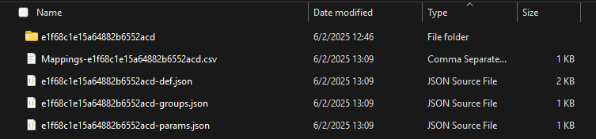

# Copy Azure Policy Initiative definitions across scopes
**Creation date:** 02 January 2024 \
**Last Update:** 02 June 2025 \
**Latest Version:** 1.2

## Index
- [Scenario](#Scenario)
- [Permissions Needed](#permissions-needed)
- [Export](#export)
- [Import](#Import)
- [Script Parameters](#script-parameters)
- [Script Code](#script-code)
- [Sample commands](#sample-commands)
- [Example](#example)
- [Known Limitations](#limitations-of-the-script)
- [Best Practices](#recommendations)
- [Release Notes](#release-notes)

## Teaser 
Imagine you are trying to copy an Azure Policy Initiative definition and all its Azure Policy definitions from one subscription to another. This Azure Policy Initiative definition is composed of built-in and custom Azure Policy definitions. Without an automation you would need to copy the Json of each custom Azure Policy definition and its parameters, then copy the json of the Azure Policy Initiative definition and its parameters and create it on the new subscription. The logic I used in the script below is the same. 
 
## Background: 
At the time of this article Azure does not have a built-in way to move Azure Policy definitions/ Azure Policy Initiative definitions across scopes, therefore I decided to write a script that leverages the existing PowerShell commands and does it across subscriptions or management groups. In my script I will be moving Azure Policy Initiative definitions and their Azure Policy definitions, but of you need to move just Azure Policy definitions you can take out from the script the functions that will do just that. 
 
For this article I will use PowerShell, but this can be achieved both with CLI/PS/REST. 
 
## Scenario: 
Imagine you are trying to copy an Azure Policy Initiative definition and all its Azure Policy definitions from one subscription to another in the same tenant. This Azure Policy Initiative definition is composed of built-in and custom Azure Policy definitions. Without an automation you would need to copy the Json of each custom Azure Policy definition and its parameters, then copy the json of the Azure Policy Initiative definition and its parameters and create it on the new subscription. The logic I used in the script below is the same. 
 
In the script you will have parameters to control whether you are importing, exporting or doing Export + Import at once (Full), this last option you will only be able to use it if you are targeting the same scope level e.g.: Subscription A to Subscription B or Management Group X to Management Group Y because the Azure Policy Initiative json output from the export needs to reflect the target scope so that it can be imported. If you need to copy from Subscription A to Management Group X you will need to execute Export and Import separately. 

## Permissions Needed
Write permissions on the folder where you are running the script from
Reader access to the Source Scope
Policy Contributor on the Target Scope

[Back to Index](#index)
 
## <a name="export">Export - Download from source:</a> 
During the export phase some files and folders will be created therefore make sure you have permissions to write on the destination folder. 
The new files created will be: 
- <InitiativeId>.json - Azure Policy Initiative definition 
- <InitiativeId>-params.json - Azure Policy Initiative definition parameters 
- <InitiativeId>-groups.json - Azure Policy Initiative groups if the Azure Policy Initiative uses them. 
- Folder with name of the InitiativeId that will contain custom policies. 
- Mappings-<InitiativeId>.csv - this file is used to keep the original names and category of Azure Policy Initiative definition and Azure Policy definitions. 
 
## <a name="import">Import – Upload to the destination: </a>
During the import, the script scans the folder looking for the value passed on the parameter $initiativeId . If it finds the json definition file, it will look for the folder that should have the custom Azure Policy definitions and it will start by creating those on the destination, once that completes it will use the Azure Policy Initiative definition file and create the Azure Policy Initiative. 
When running this step separately you should make sure that the InitiativeId.json file is updated to reflect the target scope. 
Example: you have exported from subscription AAA and you are importing to Management group XXX you need to replace each policyDefinitionId in the json from /subscription/AAA/ providers/Microsoft.Authorization/policyDefinitions/PolixyExample to /providers/microsoft.management/managementgroups/XXX/providers/microsoft.authorization/policyDefinitions/PolixyExample 
- During import there is a file named <InitiativeId>-def-imported.json that is created and deleted this file holds the same definition with the target scope updated.

[Back to Index](#index)
 
## Script Parameters 

- **$direction:**
The direction controls whether the script will export from source, import to destination, or do both at once (Full). The allowed values are Export, Import, Full. 

- **$initativeId: (i, ini)**
The Initiative Id is the last segment of the Azure Policy Initiative resource id. 
If you pass a * on Export phase it will get all the Azure Policy Initiatives on the scope + parent scope, on the Import phase it will try to import all the Azure Policy Initiative definitions in the folder. 

- **$scope**
The scope for the Export/Import. Allowed scopes are Subscription and ManagementGroup.
You can use Sub and MG as short name of each scope. 
Default value is subscription. 
  
- **$source (src)**
The Source id, if the $scope is subscription it takes the subscription id, if the $scope is ManagementGroup it takes the Management Group Id. 
  
- **$target (t, trgt)**
The $target id, if the $scope is subscription it takes the subscription id, if the $scope is ManagementGroup it takes the Management Group Id. 
You can set this parameter during the export so that you don't need to manually replace the source subscription by the destination.
  
- **$overwrite (ow)**
The $overwrite parameter is used only on the import phase, and can be used to  overwrite the files generated by the script in case off a second execution.
 
- **$defaultCategory (dcat)**
The $defaultCategory parameter is by default “ExportImportScript” and it is used to assign a category to the Azure Policy Initiative definition and Azure Policy definitions that don’t have one set. 
 
- **$overwriteCategory (owcat)**
The $overwriteCategory parameter is used to overwrite the categories on both Azure Policy Initiative definition and Azure Policy definitions. 
This parameter is only used during the import phase. 
 
- **-Verbose**
Adds some outputs to view the commands executed and information about the execution. 
 
- **-Debug**
will show the json of policy and initiative definitions along with the debug information from the actual commands. 

[Back to Index](#index)

## Script Code: 

Link to the file [Export_Import_Initiative.ps1](Export_Import_Initiative.ps1)

[Back to Index](#index)
 
## <a name="sample-commands">Sample execution commands: </a>

**Export on subscription:**

.\Export_Import_Initiative.ps1 -direction Export -ini _#InitiativeID#_ -scope Sub -src _#SourceSubId#_ -ow -verbose

.\Export_Import_Initiative.ps1 -direction Export -ini _#InitiativeID#_ -scope Sub -src _#SourceSubId#_ -trgt _#TargetSubId#_ -ow -verbose

.\Export_Import_Initiative.ps1 -direction Export -ini _#InitiativeID#_ -scope mg -src _#SourceManagmentGroup#_ -ow -verbose

.\Export_Import_Initiative.ps1 -direction Export -ini _#InitiativeID#_ -scope mg -src _#SourceManagmentGroup#_ -trgt _#TargetManagmentGroup#_ -ow -verbose 
 

**Import to subscription:**

.\Export_Import_Initiative.ps1 -direction Import -ini _#InitiativeID#_ -scope Sub -trgt _#TargetSubId#_ -verbose

.\Export_Import_Initiative.ps1 -direction Import -ini _#InitiativeID#_ -scope mg -trgt _#TargetManagmentGroup#_ -verbose 
 

**Full (Export + Import) on subscription scope:**

.\Export_Import_Initiative.ps1 -direction Full -ini _#InitiativeID#_ -scope Sub -source _#SourceSubId#_ -t _#TargetSubId#_ -verbose 

.\Export_Import_Initiative.ps1 -direction Full -ini _#InitiativeID#_ -scope mg -source _#SourceManagmentGroup#_ -t _#TargetManagmentGroup#_ -verbose 

[Back to Index](#index)

## Example: 
Let's imagine that we are running the script to export an Azure Policy Initiative definition with id e1f68c1e15a64882b6552acd 

  
After running the script with direction Export:

 
You will end up with the following files:

- The file “e1f68c1e15a64882b6552acd-def.json” will hold the Azure Policy Initiative definition with the reference to the Azure Policy definitions contained in it. 
- The file “e1f68c1e15a64882b6552acd-params.json” will hold the Azure Policy Initiative definition parameters. 
- The file “e1f68c1e15a64882b6552acd-groups.json” will hold the Azure Policy Initiative groups. 
- The file “Mappings-e1f68c1e15a64882b6552acd.csv” will contain the relation between Azure Policy Initiative definition/Azure Policy definitions Ids and their display name and category.

You can use this file to rename the Azure Policy Initiative / Azure Policy definitions on the target scope 
- The folder will contain all the json files related to the Azure Policy definitions  and its parameters: 

This Azure Policy Initiative definition is composed by 4 Azure Policy definitions, but because one is a built-in, we only have 6 files 2 per each of the 3 custom Azure Policy definitions (Definition + Parameters). 
The built-in Azure Policy definitions exist by default in all subscriptions. 

[Back to Index](#index)
 
## Limitations of the script: 
- Running the Export + Import in one go using the $direction parameter with value "Full" will only work if you are in same tenant and if done from Subscription to Subscription or Management Group to Management group. 
- When running export on Azure Policy definitions that have parameters pointing to resources within the source scope, you might need to manually adjust those to reflect a valid parameter on the target scope. 

[Back to Index](#index)
  
## Recommendations:
It is recommended that you use the script in 2 steps: 
- First you export and validate the exported data. 
- Then you adjust the ids of the Azure Policy Initiative json and import to the target scope. ()
If you need to adjust the display names or categories of the Azure Policy Initiative definition and Azure Policy definitions you can use the mappings CSV that is created by the export part of the script. 
- You should be able to run this on CloudShell if you upload the script there.

[Back to Index](#index)
  
## Documentation for Az PowerShell commands used: 
- [https://learn.microsoft.com/en-us/powershell/module/az.resources/new-azpolicydefinition?view=azps-11.1.0](https://learn.microsoft.com/en-us/powershell/module/az.resources/new-azpolicydefinition?view=azps-11.1.0)
- [https://learn.microsoft.com/en-us/powershell/module/az.resources/new-azpolicysetdefinition?view=azps-11.1.0](https://learn.microsoft.com/en-us/powershell/module/az.resources/new-azpolicysetdefinition?view=azps-11.1.0)
- [https://learn.microsoft.com/en-us/powershell/module/az.resources/get-azpolicydefinition?view=azps-11.1.0](https://learn.microsoft.com/en-us/powershell/module/az.resources/get-azpolicydefinition?view=azps-11.1.0)
- [https://learn.microsoft.com/en-us/powershell/module/az.resources/get-azpolicysetdefinition?view=azps-11.1.0](https://learn.microsoft.com/en-us/powershell/module/az.resources/get-azpolicysetdefinition?view=azps-11.1.0)
 

 [Back to Index](#index)

 ## Release Notes

 Version 1.2:
 - Added support to groups in the initiative
 - Replace of target scope during import.
 
## Disclaimer: 
**This script is not supported under any Microsoft standard support program or service. This script is provided AS IS without warranty of any kind. Microsoft further disclaims all implied warranties including, without limitation, any implied warranties of merchantability or of fitness for a particular purpose. The entire risk arising out of the use or performance of the script and documentation remains with you. In no event shall Microsoft, its authors, or anyone else involved in the creation, production, or delivery of the script be liable for any damages whatsoever (including, without limitation, damages for loss of business profits, business interruption, loss of business information, or other pecuniary loss) arising out of the use of or inability to use the current script or documentation, even if Microsoft has been advised of the possibility of such damages.**

